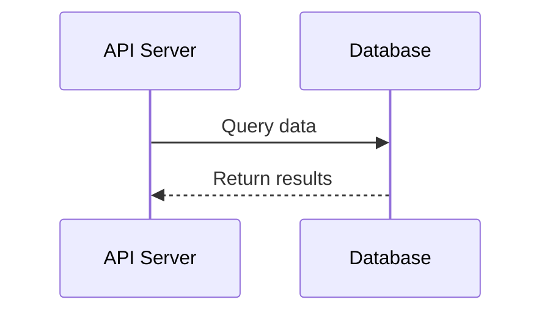
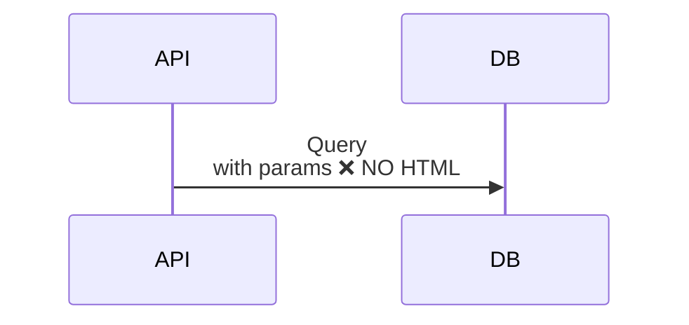

# Freud
Deep technical analysis of services with code documentation including architecture diagrams, database schemas, sequence flows, and critical reviews.

## Triggers
- "analyze this service"
- "analyze service"
- "create service documentation"
- "document this codebase"
- "service deep dive"

## Instructions

When asked to analyze a service, create comprehensive technical documentation with visual diagrams and critical reviews.

The result is a `.html` named `ANALYSIS.html`. If this file already exists read it first.

If the file already exists check to see if there have been changes to its state firts.

Start from `assets/template.html` — copy it to `ANALYSIS.html` and fill in each section per the Analysis Process below, following the HTML comments in the template for what varies per repeating block.

### Visual Design Requirements

**Page Styling**
- Use a "Gruvbox" style theme

**Components:**
- Professional gradient header
- Card-based layouts with hover effects
- Syntax-highlighted code blocks
- Database tables with visual badges
- Info/warning/success boxes with left border
- Responsive CSS for mobile

**Mermaid Diagrams:**
See `assets/template.html` for the exact Mermaid CDN script tag and `initialize()` config — copy it as-is.

- **CRITICAL**: Never use HTML tags in Mermaid diagrams


### Analysis Process

1. **Static & Dynamic Analysis (Go)**

   Run these first, before anything else, so results are ready when the review
   section is written. Each command is non-interactive. If a command fails to
   *run at all* (not just fails checks), capture the error and continue —
   never stop the review because a tool is missing.

   Skip `vendor/` and generated dirs. Cap tests: `-timeout=120s`.

   Stdlib (always run):
   - `go build ./...`
   - `go vet ./...`
   - `go test -race -timeout=120s ./...`
   - `go test -covermode=atomic -coverprofile=cover.out ./... && go tool cover -func=cover.out`
   - `go mod tidy -diff` (Go 1.23+)
   - `go list -m -u all`

   Near-standard (run if installed, else skip and render a "Tools Not Run"
   card at the top of the Technical Review section listing each missing tool
   with its install command):
   - `govulncheck ./...` — install: `go install golang.org/x/vuln/cmd/govulncheck@latest`
   - `deadcode ./...` — install: `go install golang.org/x/tools/cmd/deadcode@latest`
   - `staticcheck ./...` — install: `go install honnef.co/go/tools/cmd/staticcheck@latest`

   Optional (only if repo is already configured):
   - `golangci-lint run` — only if `.golangci.yml` exists
   - `gosec ./...` — only if `.gosec.yaml` or similar exists

   Feed results into the review:
   - `go vet`, `staticcheck`, `gosec` findings → **Concerns**
   - Race failures → **Concerns**; bump risk to High
   - Per-package coverage → table in review; flag <40% as **Concerns**
   - `govulncheck` hits → **Concerns** with CVE IDs
   - `deadcode` output → **Recommendations** (delete list)
   - Non-empty `go mod tidy -diff` → **Concerns**

   **Tools Not Run card** — one info card, only if at least one near-standard
   tool was missing. Title: "Tools Not Run". Body: one line per missing tool,
   `<tool>` followed by the exact install command. If all three ran, omit the
   card entirely.

2. **Discovery Phase**
   - Explore directory structure
   - Read README, go.mod/package.json, Dockerfile
   - Read `vendor/github.turbine.com/MGP-Server/bos-protos/`
     - This is the imported API monorepo
     - This is not present in all repos
     - If it is present add a section in API listing which protos are used
   - Start from `main.go`
   - Map configuration files and environment variables
   - List dependencies and external services

3. **Architecture Analysis**
   - Document service purpose and key features
   - Identify architectural patterns
   - Map HTTP or gRPC endpoints and handlers
     - Identify other service dependencies using the `vendor/github.turbine.com/MGP-Server/bos-protos/` directory
   - Analyze middleware and request flow
   - Document concurrency patterns
   - Review error handling strategy

4. **Database Deep Dive**
   - Read all migration files in db/, migrations/, or similar
   - Extract complete table DDL
   - Document columns with types and constraints
   - Create visual HTML tables with constraint badges (PK, FK, UNIQUE, NOT NULL)
   - Generate entity relationship diagram
   - Document stored procedures with business logic
   - Identify indexes and performance concerns

5. **Flow Visualization**
   - Create 3-6 focused sequence diagrams (one per domain)
   - Build state machines for stateful entities (jobs, orders, workflows)
   - Design decision trees for complex conditional logic
   - Keep each sequence diagram to 6-8 participants max

6. **Code Review**
   - Document architectural strengths
   - Identify concerns and code smells
   - Provide specific, actionable recommendations
   - Assess operational risk level (Low/Medium/High)
   - Review test coverage

### Output Format

Generate a single self-contained HTML file: `ANALYSIS.html`

Structure:
```
1. Header with service name and description
2. API & Endpoints Section
3. Architecture & Dependencies Section
4. Flow Diagrams Section
   - Multiple focused sequence diagrams
   - State machines
   - Decision trees
5. Database Schema Section
   - Visual table representations
   - Entity relationship diagram
   - Stored procedure documentation
6. Technical Review Section
   - Strengths (green box)
   - Concerns (yellow box)
   - Recommendations (blue box)
   - Risk assessment
```

### Database Table Template

See `assets/template.html` for the exact markup — copy the `.db-table-container` block as-is, one per table.

### Sequence Diagram Best Practices

**DO:**
- Break into multiple focused diagrams (Build Flow, Deploy Flow, Monitor Flow)
- Use clear, concise labels without HTML
- Show error paths with `alt` blocks
- Keep to 6-8 participants per diagram

**DON'T:**
- Use `<br/>` or any HTML tags in Mermaid
- Create mega-diagrams with 15+ participants
- Skip error handling flows

**Good Example:**


**Bad Example (DO NOT DO):**


### Technical Review Framework

**Strengths to Highlight:**
- Clear separation of concerns
- Interface-based design
- Comprehensive error handling
- Good observability (logging, metrics, tracing)
- Graceful degradation patterns
- Circuit breakers and retries
- Distributed locking (if applicable)

**Concerns to Flag:**
- Missing error handling
- Potential race conditions
- Resource leaks (goroutines, connections)
- Missing timeouts or retries
- Single points of failure
- Unbounded operations
- Magic numbers
- Missing tests

**Risk Assessment Criteria:**
- **Low**: Well-tested, handles errors, no obvious issues
- **Medium**: Some concerns but core logic is sound
- **High**: Critical issues, potential data loss, production incidents likely

### Quality Checklist

Before finalizing, ensure:
- [ ] All Mermaid diagrams render without syntax errors
- [ ] Database tables are visual HTML tables (not text)

- [ ] Multiple focused sequence diagrams (not one mega-diagram)
- [ ] State machines for stateful entities
- [ ] Decision trees for complex logic
- [ ] Technical review has both strengths AND concerns
- [ ] Recommendations are specific and actionable
- [ ] Risk level clearly stated
- [ ] Code examples have syntax highlighting

if `./db` exists
- [ ] ERD shows all table relationships

- [ ] All sections complete

## Example Usage

**User Input:**
```
Analyze this service
```

**Expected Behavior:**
1. Explore codebase systematically
2. Read key files (main.go, migrations, config, etc.)
3. Create comprehensive HTML documentation
4. Save as cd-service-analysis.html
5. Report: "Analysis complete. Key findings: [summary]"

## Tips for Success

- Start with README and main entry point
- For Go services, look for main.go and server setup
- Database migrations are usually in db/, migrations/, or schema/
- Look for .drone.yml, .github/workflows, or Dockerfile for deployment
- Check go.mod, package.json, or requirements.txt for dependencies
- State machines are common for: jobs, orders, workflows, state machines
- Always provide specific line numbers or file references in reviews
